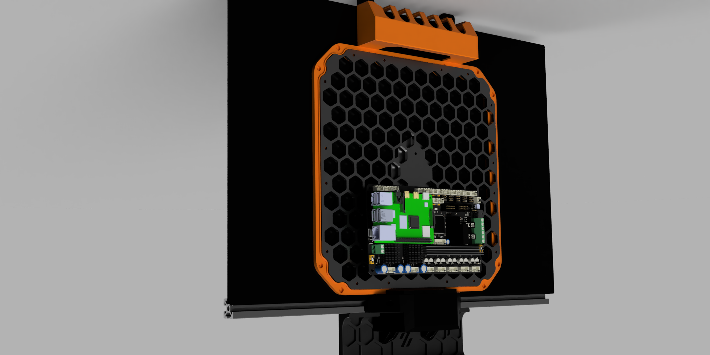
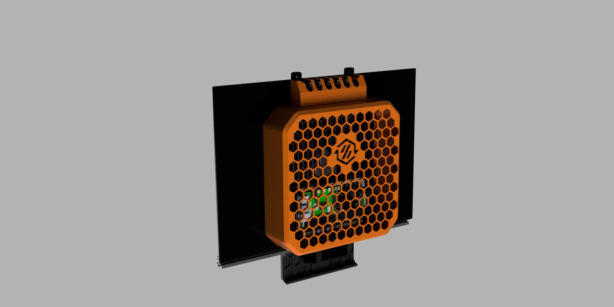
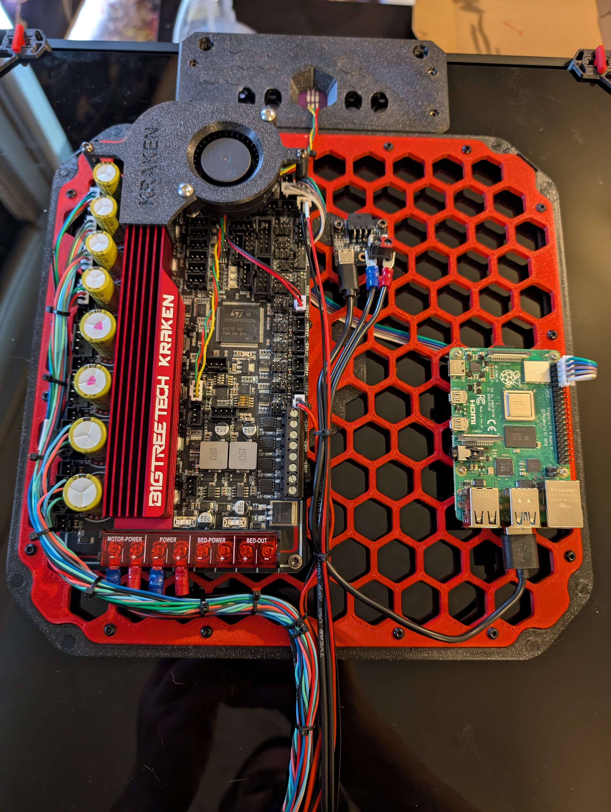
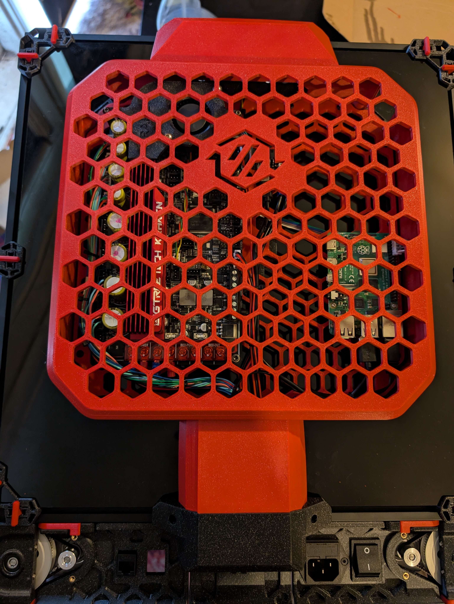

# hexabackpack
Hexabackpack - Spaghetti management backpack with Backpack With FT EMS Hexes to enable flexible and fully modular mounting.

Inspired by DraftShift Design Fannypack and the excellent FT EMS mounting system by Fizzy's Tech.

Included the mounts from: https://www.printables.com/model/558357-ft-ems-mounts-repository for completeness

Draftshift Design Fannypack available here: https://github.com/DraftShift/CableManagement/tree/main/FannyPack

## Images
Renders

Pictures from N3MI

## Parts to print:
- 1x Hexabackpack_Backplate_Wall.stl
- 1x Hexabackpack_Backplate_Lid.stl
- 1x Hexabackpack_Backplate.stl
- 1x Hexabackpack_backplate_hexes.stl
- 1x Hexabackpack_mid_piece.stl
- 1x Draftshift Design [ Fannypack - center_rear_skirt_90.stl](https://github.com/DraftShift/CableManagement/blob/main/FannyPack/STLs/wire_duct/center_rear_skirt_90.stl)
- 1x Exhaust plate [Umbilical management system by N3MI-DG ](https://github.com/DraftShift/CableManagement/tree/main/UserMods/N3MI-DG)

## Parts used from fannypack
1x https://github.com/DraftShift/CableManagement/blob/main/FannyPack/STLs/wire_duct/center_rear_skirt_90.stl

## BOM per latch (need 6 latches in total):
| Part                        | for       | Amount    | Description|
|-----------------------------|-----------|-----------|-|
| M3x8 BHCS Screw             | hexes+lid     | 24         | M3 BHCS screw |
| M3 Heatset Nut              | hexes     | 16         | M3 Heatset M3, 5mm OD, 4mm length |
| 6x3 Countersunk N52 magnet   | wall+backplate | 16         | 6x3 Countersunk N52 magnet (optionally you can use normal 6x3 magents and glue them in) |
| 2x8mm FHCS self-tapping screw | hexes     | 8         | 2x8mm FHCS countersunk screw (if not glueing magnets) |